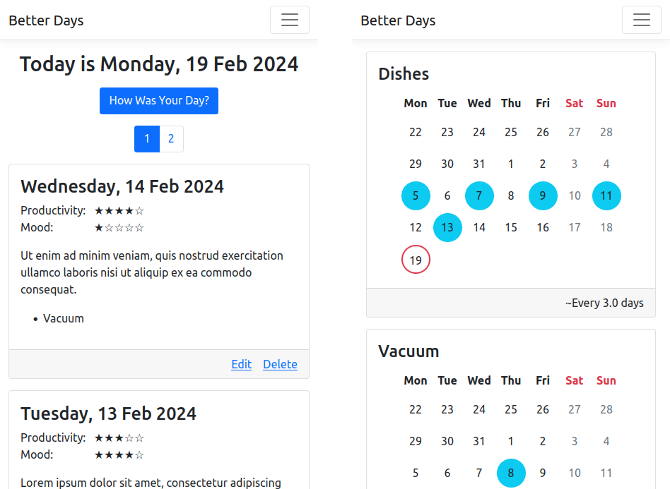

# Better Days
A small diary app that allows you to track your productivity every day.
Reflect on your life, improve your habits and yourself.

## Features
- Allows you to track your productivity and mood score, repeating tasks ("deeds")
- Each user has their own deed list and note history inaccessible to others
- Calendar view showing recent history

## Technicalities
The app runs on .NET 8 in a Docker container and uses an SQLite database (the file is configured in `appsettings.json`).
